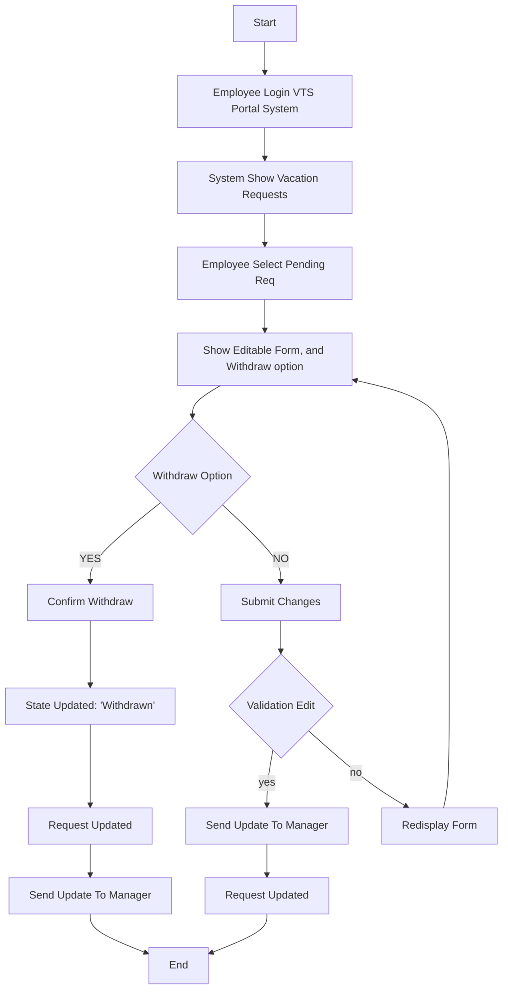

# Edit Pending Vacation Request

## Goal
Allow an employee to edit the title, comments, or dates of a pending vacation request.

## Actor
- **Employee**

## Preconditions
- Request status is **Pending approval**  
- Employee is **authenticated**

## Main Flow
1. Employee logs into the **Vacation Tracking System (VTS)**.  
2. System displays all vacation requests and the employee’s vacation balance.  
3. Employee selects a **pending request**.  
4. System shows an editable form containing:  
   - Title  
   - Dates  
   - Description/comments  
5. Employee updates the fields and submits the changes.  
   - If the employee chooses **Delete/Withdraw**, the flow redirects to **Withdraw Request** use case.  
6. System validates the updated details and saves the changes.  
7. Employee is returned to the main VTS dashboard.

## Notes
- Only pending requests can be edited.  

## Flowchart

## Pseudocode

    BEGIN Vacation_Request_System
    DISPLAY "Employee Login VTS Portal System"
    CALL Employee_Login()
    
    DISPLAY "System Show Vacation Requests"
    vacation_requests = GET_Employee_Vacation_Requests()
    DISPLAY vacation_requests
    
    DISPLAY "Employee Select Pending Req"
    selected_request = SELECT_Pending_Request(vacation_requests)
    
    DISPLAY "Show Editable Form, and Withdraw option"
    CALL Display_Editable_Form(selected_request)
    
    IF Withdraw_Option_Selected() THEN
        DISPLAY "Confirm Withdraw"
        IF User_Confirms_Withdraw() THEN
            UPDATE request_state TO 'Withdrawn'
            DISPLAY "State Updated: 'Withdrawn'"
            CALL Update_Request(selected_request)
            CALL Send_Update_To_Manager(selected_request)
            DISPLAY "End - Request Withdrawn"
        ELSE
            RETURN TO Display_Editable_Form(selected_request)
        END IF
    ELSE
        DISPLAY "Submit Changes"
        user_changes = GET_Form_Changes()
        
        IF Validate_Edits(user_changes) THEN
            CALL Update_Request(user_changes)
            CALL Send_Update_To_Manager(user_changes)
            DISPLAY "Request Updated Successfully"
            DISPLAY "End - Changes Sent to Manager"
        ELSE
            DISPLAY "Validation Failed - Redisplay Form"
            DISPLAY_ERROR_MESSAGES()
            RETURN TO Display_Editable_Form(selected_request)
        END IF
    END IF
    END Vacation_Request_System

    FUNCTION Employee_Login()
    INPUT username, password
    IF VALID_CREDENTIALS(username, password) THEN
        RETURN SUCCESS
    ELSE
        DISPLAY "Login Failed"
        RETRY OR EXIT
    END IF
    END FUNCTION
